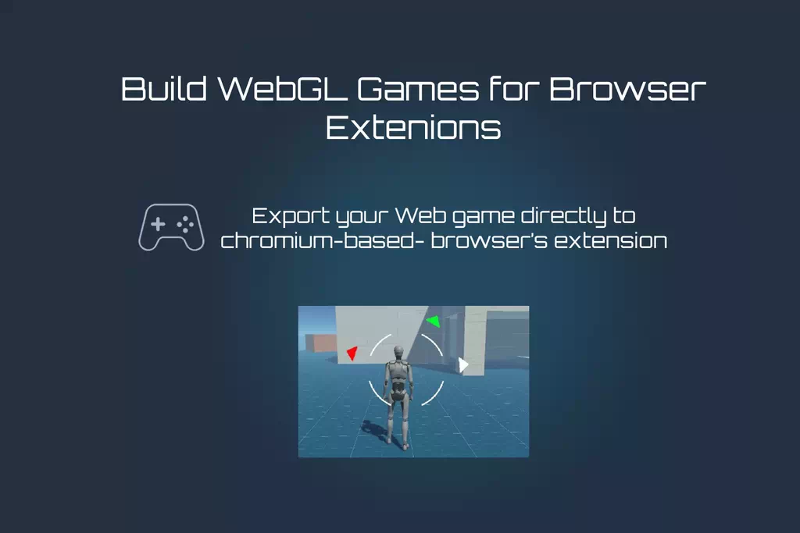

# Unity WebGL Optimizer for Web and Chrome Extension

What contains here:
- Unity WebGL Optimizer 
- Build Games for Browser Extension.
- Responsible WebGL Templates from GameMonetize

Unity WebGL Optimizer part forks form unity-optimizations-package-for-webgl by [CrazyGames](https://developer.crazygames.com/). 

Unity assets or game asset optimaztion is a big topic. You can not expect the magic will happen just with one simple click. For example, compress texture will get nothing obvious improvment some time. You may need to consider reduce texture size, and disable mipmaps. This will cause some visual quality lose, but it will reduce the package size very obviously. The same apply to other asset type, mesh (reduce triangles), audio (convert to low quality audio file with lots of compression). So I re-light the legacy project and keep some asset inspect function by hand, and give deeper view of what your game assets need change. You need to keep somehow balance between game package size and the quality. This process will repeat and again and again until you find the right point.  For this reason, i re-lit this no longer maintained project.

## Unity WebGL Optimizer

⚠️ This project is no longer maintained. We are moving towards a [custom Unity build script](https://docs.crazygames.com/resources/unity-custom-build/) that will automatically apply the best settings that were suggested by the optimizer, in addition to the other export tips from our [documentation](https://docs.crazygames.com/resources/optimization-tips/). The custom build tool also includes a better assets analyzer, offering more tips and one-click quick fix buttons. (The latest version is UnityCrazySDK.unitypackage)

The purpose of this package is to help you optimize your game by reducing the build size and increasing the performance. At the moment, it is targeted at WebGL games.

If you are using our CrazySDK, this package will come integrated with it.

Minimum required versions:

- C# 6.0
- Unity 2019

Once you have imported the package from GitHub, or our SDK which also contains this tool, it will be accessible in the `Tools > WebGL Optimizer` menu option.

### Export optimizations

The export optimizations tab contains a checklist of options that should be correctly set to improve the performance and decrease the bundle size of your WebGL game.

### Texture optimizations

The texture optimizations tool provides an overview of all the textures in your project, and also various tips about optimizing the size they occupy in the final build.

It finds textures in your project in these 2 ways:

1. By looking at the scenes included in the build (Build settings > Scenes in build), and finding recursively all the textures on which those scenes depend.
2. By finding textures in `Resources` folders, or by recursively finding textures on which the assets from the Resources folders depend.

This means that the texture detection may miss more intricate textures that are not covered by the above cases.

You can toggle the "Include files from Packages" options to also display textures from the installed packages, for example from Package Manager.

### Model optimizations

The model optimizations tool works very similar to the texture optimizations tool, but instead of textures it finds models in your project and provides various tips about optimizing them.

### Audio clip optimizations

The audio clip optimizations tool works very similar to the texture optimizations tool, but instead of textures it finds audio clips in your project and provides various tips about optimizing them.

### Build logs analyzer

The build logs analyzer parses the Editor.log file to extract the list of files included in your build and the space they occupy. You can use this utility to furthermore analyze the files included in your project.

Similar to the texture optimizer, you can toggle the "Include files from Packages" options to also display textures from the installed packages, for example from Package Manager.

### Unity WebGL Game Examples - Arcade H5 Online Games

We use such assets optimized tech to reduce the package size as more as possible, and keep a good game play experience at the same time. You could play around on [online arcade html5 Games](https://www.arcadeh5.com/) and see how it works.

## Build Games for Browser Extension

Easily export your Unity game as a Chrome extension with minimal setup! This asset streamlines the entire process, letting you package and deploy your game directly to the Chrome Web Store. You could get this free unity asset from [unity asset store](https://assetstore.unity.com/packages/tools/utilities/build-games-for-browser-extension-308254).

Here are some webgl games that for chrome extension. Yeach, they are definitely smooth and experience well.  
- [Zigzag Driving](https://chromewebstore.google.com/detail/zigzag-driving/niikfbmfdkbljedepaoigbciipdccadp)
- [Double Crash](https://chromewebstore.google.com/detail/double-crash/bibdbnjngkpfaaelfcckehdpdibgipli)

## GameMonetize WebGL Template

WebGL Template suitable for desktop and mobile. 

